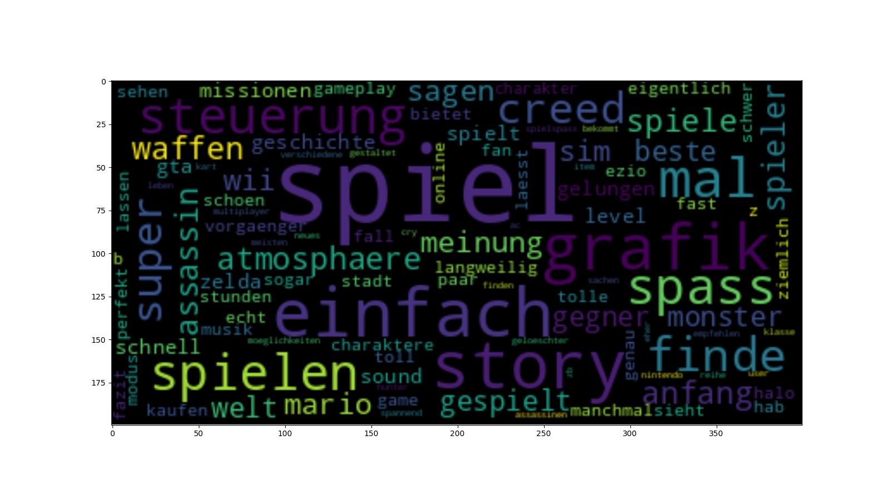
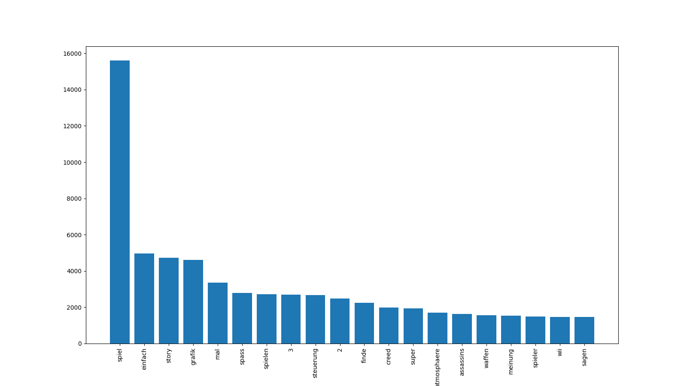

# Project State

## Planning State 

We were making progress for the first milestone, which includes collecting the dataset. For that we implemented a webscraper for user reviews for different games on https://www.spieletipps.de/ that collects the reviews as well as the users ratings according to the four aspects: graphics, sound, controls and atmosphere. The rating ranges from 0 to 5, where zero is the worst and 5 the best.
We stored the raw data in a json file, one for each game, where we have the title of the game and the reviews as keys. The reviews are stored in a list which again contains a dictionary with the actual text and the star rating of the review. However, implementing the webscraper was very challenging due to pop-ups on the page. Even though we found a way to handle most of them, it might still be the case that webscraper will be unable to close the pop-up and hence is unable to collect the data from that page. To solve this, one can just run the webscraper for that page again and usually it will be able to close the pop-up in a second or third run. Of course this solution is not very elegant, but solving that problem automatically via code has a low priority, since we only need one valid run for each page to obtain our dataset and don't need the webscraper regularly.
Second part includes preprocessing of the raw data in a way so that we obtain a dataset, which can then be used for the actual aspect based sentiment analysis. The aim was to obtain a dataset similar to SentiHood (https://github.com/uclnlp/jack/blob/master/data/sentihood/sentihood-train.json). We achieved that by using regular expressions to detect the aspects and creating a dictionary entry for each of those sentences that contain at least one word that refers to one of the four aspects. This dictionary contains more information about the detected words and the aspect they relate to as well as the respective sentence, where the detected word is replaced with one of the tokens "GRAPHICS", "CONTROLS", "SOUND" and "ATMOSPHERE" depending on its aspect.


## Future Planning

First, we still need to apply some changes to the preprocessing part. For example, it might be the case that the webscraper is not able to extract the star rating, even if it actually exists (due to different tags for star ratings that we haven't seen before). That's why we might want to remove all ratings where he have zero stars for every aspect, even if the user really rated all aspects with zero stars. In this case it is less dangerous to remove some valid reviews, instead of including some with wrong ratings.
Furthermore, as already mentioned the detection of the aspects is implemented via regex. More precisely, we are looking for the aspect itself, synonyms and words that include those. However, this step is not based on any statistical analysis of our dataset, we just used words that are usually common for that. So this step could be improved by some further analysis of our dataset.
Next, now that we created a dataset our next milestone is to implement the actual aspect based sentiment analysis. For that we first have to make a decision about the method we want to use (for example: https://www.ijcai.org/Proceedings/15/Papers/194.pdf which gives a lot of detailed information). No matter which paper exactly we want to use for this, there are some steps that are quite common for this task. This includes for example the representation of the words in a sentence via word2vec, the removal of words that do not appear in a sentiment lexicon (examples for german sentiment lexicons: https://github.com/sebastiansauer/pradadata/blob/master/data-raw/germanlex.csv or https://www.kaggle.com/rtatman/german-sentiment-analysis-toolkit) and lemmatization to be able to compare the words in a sentence to the sentiment lexicon.


## High-level Architecture Description

For now, the preprocessing pipeline we want to implement, looks like the following:

 At first we need to do some basic processing in the form of normalization followed by stop word removal, as this will make our results more consistent. Since we settled on reviews in the german language, stemming doesn't look like a viable option anymore. This shouldn't be impossible, but since german is a more complex language than english, due to the nature of verb conjugations, which may cause the stem of a word to change, we decided against it. Luckily, `spacy` supports lemmatization for german words, with which we can use to find the base form ("lemma") of a word.

Afterwards we need to find out which words people generally use to describe the four aspects we try to train for (graphics, sound, controls, atmosphere). This could be done by counting words in the dataset with different measures (e.g. plain word count, tf-idf) or by looking up different lexica to find similar words.

After all this processing we should have a dataset containing reviews with labelled aspects and their potential sentiment (in form of user given rating). With enough samples we hopefully will account for inconsistencies created by the user himself, since it's totally possible that the user rates the graphics 5/5 stars, but describes them as being bad and vise versa. This is something we will have to examine, once we actually try to train with the data.


# Data Analysis

## Basic Statistics

Our intial dataset consists of 6894 reviews, which are stored in `.json` files as described earlier. The reviews are split among 42 games and a total of 10195 sentences containing at least one aspect.
At first we made some very basic analysis and started with a word cloud for all spoken words. For this we normalized the text and removed stop words.



The first thing that popped into sight is the word 'game'. This makes totally sense, since people are writing reviews about games, the word would naturally be used when referring to the target of the review. Therefore we also looked at the raw word count, to see how often it occurs.



As you can see, the word 'game' leads the charts by quite a lot. That's why we would probably have to remove it, since for our project we don't get any value from it. Another good sign is the frequency of the words 'story', 'graphics', 'controls' and 'atmosphere', since those are the aspects we want to train for and people are apparently writing about those quite a lot. From the wordcloud we can also gather that people are also writing about their sentiment towards some things, since we see the words 'great' and 'fun'. The only potential issue here being, that the wordcloud does not contain any words with negative sentiment, which could mean two things. On one hand it could be that the general sentiment towards the selected games. On the other hand people may be more inclined to write about games they like. Either way, we propably have to diversify our dataset more and might need to explicitly include games which are rated poorly.

## Data Sample
Raw data sample:
```json
{"text": "Von Hamstergaming  (2):  Neben Assassin's Creed Black Flag und Assassin's Creed Rogue geh\u00f6rt dieser Teil zu einer der besten die Story ist ganz in Ordnung daf\u00fcr dass es um Rache geht und die Grafik ist auch sch\u00f6n anzusehen. \nEs geh\u00f6rt mit zu den besten weil man verschiedene Arten von Fortbewegungsm\u00f6glichkeiten hat wie z.B. in Venedig wo man sehr gut mit dem kleinen Boot vorankommt oder Monterigioni wo das Reiten sehr effektiv ist dazu liefert das Spiel noch Rennen mit den Fortbewegungsmitteln wie z.B. einem Kutschenrennen oder das klassische auf den D\u00e4chern h\u00fcpfen.Ist diese Meinung hilfreich?", 
"rating": {"Grafik": 4, "Sound": 3, "Steuerung": 4, "Atmosph\u00e4re": 5}}
```
